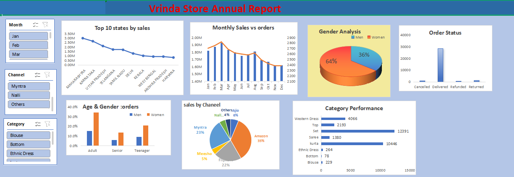

## 🛒 Annual E-Commerce Sales Report – Vrinda Store (Excel-Based Analysis)

## Project Overview

**Project Title**: Analysis of Vrinda store sales
**Level**: Beginner  
**Dataset**: `Vrinda store.xlsx`

📌 Overview

This beginner-friendly project focuses on analyzing e-commerce sales data using Microsoft Excel. It covers the complete data journey—from import and cleaning to processing and insightful dashboard creation. The dataset includes customer-level transaction details, offering a comprehensive look at order status, customer demographics, product categories, sales channels, and regional performance.

## 🎯Objectives
  Vrinda Store aims to create a comprehensive annual sales report for the current year.This report will help the business better understand customer demographics, purchase behavior, product trends, and channel performance. By analyzing this data, Vrinda Store can make informed decisions to:

- Increase customer engagement 
- Improve marketing and sales strategy
- Identify top-performing products and regions
- Optimize sales channels
- Boost overall revenue in the upcoming year

## 🗂️ Project Structure

1. **🗃️ Dataset Details**

File Name: rawdata of Vrindastore.xlsx

Primary Sheet: Vrinda Store

-- Fields:

- Order ID
- Customer ID
- Gender
- Age
- Product Category
- Quantity
- Channel (Ajio, Amazon, Flipkart, etc.)
- Order Status (Delivered, Cancelled, Refunded)
- Total Amount
- State

2. **Data Cleaning**

Steps taken to clean the data:

✅ Removed duplicates based on Order ID.
✅ Filled missing values in Total Amount and Quantity using logical estimations.
✅ Standardized categorical fields like Gender, Status, and Channel (case formatting, spelling consistency).
✅ Checked for invalid ages and filtered out unrealistic entries.
✅ Removed blank rows and columns to maintain a clean dataset.

3. **⚙️ Data Processing**

The dataset was transformed using:

- Pivot Tables to summarize metrics like total sales, order counts, and customer demographics.
- Calculated Columns for age brackets and derived metrics (e.g., Average Order Value).
- Named Ranges & Slicers for easy interaction and dynamic analysis.
- Filters to isolate key segments (month, state, channel).

# 💡 Business Questions

This analysis was designed to answer key business questions, including:
- Compare the sales and orders using single chart?
- Which month got the highest sales and orders?
- Who purchased more-men or women in 2022?
- What are different order status in 2022?
- List top 10 states contributing to the sales/
- Realation between age and gender based on numer
- Which channel is contributing to maximum sales
- Highest selling category?
- What are the peak months for sales and order volume?
## 🔍 Data Analysis & Dashboard

The analysis is split across several worksheets:

- Dynamic Filters: Slicers for Month, Channel, and Category allow for real-time insights.
- Interactive Charts: Pie charts, bar graphs, and line charts for intuitive visual storytelling.
- Geographical Map: Top 10 states highlighted by performance.
- KPI Snapshots: Quick-view metrics for sales, orders, and delivery rates.

## 📈 Summary Sheets** :
The analysis is split across several worksheets:

- **Monthly Sales vs Orders**: Monthly trends in sales and orders.
- **Gender Analysis**-wise contribution and customer count.
- **Order Status Summary**: Breakdown of fulfilled, cancelled, and refunded orders.
- **Top 10 States by Sales**: Highest-performing states by revenue.
- **Sales by Channel**: Channel-wise order volume and effectiveness.
- **Age & Gender Distribution**: Age group analysis by gender.
- **Product Category Performance**: Sales volume by product categories.
- **Dashboard**: A central dashboard consolidating all visuals.

## 📊 Key Insights

- **Top Performing Region**: Maharashtra leads in total revenue.
- **Peak Sales Months**: Identified via a monthly trend line chart.
- **Dominant Gender**: Female customers contribute a higher number of orders.
- **Demographic Trends**: Adult women aged 25–35 are the most active shoppers.
- **Most Effective Channel**: Amazon tops the chart in total orders.
-**Category Trends**: Certain product categories drive the bulk of revenue.
- **Order Fulfillment**: The majority of orders were delivered successfully, with a small percentage cancelled or refunded.

## 🖥️ Dashboard Features

- **Dynamic Filters**: Slicers for Month, Channel, and Category allow for real-time insights.
- **Interactive Charts**: Pie charts, bar graphs, and line charts for intuitive visual storytelling.
- **Geographical Map**: Top 10 states highlighted by performance.
- **KPI Snapshots**: Quick-view metrics for sales, orders, and delivery rates.

## ✅ How to Use

- Open Vrinda store.xlsx in Excel.
- Start with the Vrinda Store sheet to view the raw data.
- Navigate through summary sheets to explore key metrics.
- Use the dashboard for an at-a-glance overview.
- Apply slicers and filters to focus your analysis.

## 📷 Visual Preview
Annual dashboard summarizing sales, customer demographics, channel performance, and regional trends.

## 📦 Tools Used

- Microsoft Excel: Pivot Tables, Charts, Filters, Formulas, Conditional Formatting
- Data Type Handling: Text cleanup, numeric validations, categorization

